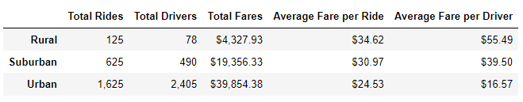
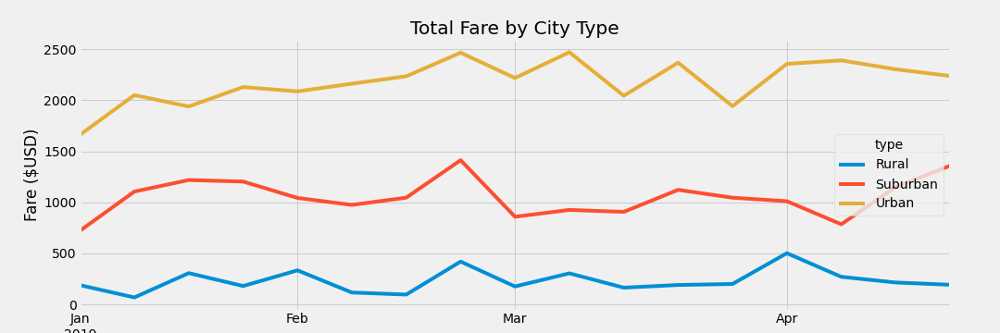

# PyBer_Analysis
Project to analyze all the rideshare data from January to early May of 2019

## Overview of the analysis:

The purpose of this project is to perform exploratory analysis of Pyber ride-sharing data by city type and create multiple-line graph that shows the total weekly fares for each city type.

## Results: 

Below is the summary of the Pyber ride-sharing data by city type.

### Findings:
- Urban city type has the most rides with 2.6 and 13 times more than Suburban and Rural city types respectively.
- Total Drivers also follows the same trend as the Total rides. Urban city type has 5 and nearly 31 times more drivers than Suburban and Rural city types.
- Even though Urban city type has the highest Total Fare amount, it has the least Fare per Ride and Fare per Driver averages.
- Rural city type has the highest Fare per Ride and Fare per Driver averages.
- Average Fare per Driver varies significantly more than Average Fare per Ride across the three City types.
- When weekly data for the sample period of Jan 2019 to April 2019 is taken into consideration, the City types follow the same treand as above. Urban city type is leading in Total sales foloowed by Suburban city type and Rural city type takes the last place. Please refer the multiple-line graph below. 

## Summary:

At high level from the above analysis, it is clear that the PyBer as a company needs to work on increasing the total ride count in Rural city type and better utilization of the drivers in Urban city type.

### Recommendations:
1. Increasing the average Fare per Driver in Urban city type by doing one of the below:
    - Run promos to increase the number of rides and utilize the extra drivers (1,625 rides versus 2,405 drivers)
    - Increase ride fare
    - Decrease the drivers
2. Increase total fares in Rural city type 
    - Increase drivers
    - Run promos
    - Increasing ride fare
3. More analysis is needed at individual city level in each city type so that more focused decisions can be made. 

